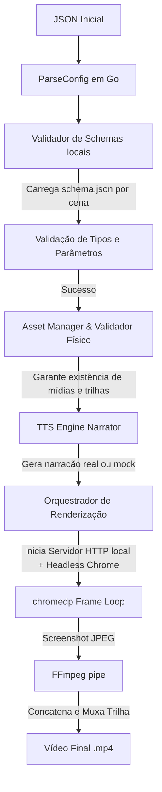

# Arquitetura do Sistema: Motor de Vídeo Baseado em HTML/CSS/JS

Este documento detalha o design de software, o fluxo de processamento de dados e a arquitetura do gerador de vídeo em Go.

---

## 1. Fluxo de Processamento Global

O processamento do vídeo segue uma arquitetura orientada a pipelines de execução linear. Com a inclusão da validação de schemas em tempo de inicialização, todas as cenas são verificadas contra as regras de seus respectivos templates *antes* de iniciar qualquer renderização ou chamada de rede.

### Detalhes das Etapas:
1. **Configuração e Validação de Schema (Fase Estática):**
   * O arquivo JSON de configuração (ex: `json_inicial`) é analisado pelo Go.
   * O sistema localiza o diretório de templates e carrega o arquivo `schema.json` para cada cena. Ele valida se as mídias requeridas e parâmetros dinâmicos (como strings, números, booleanos ou arrays) estão configurados corretamente.
2. **Validação Física de Ativos:**
   * O `AssetManager` verifica se todos os arquivos locais passados nas configurações realmente existem em disco.
3. **Conversão de Texto em Fala (TTS):**
   * O texto de narração de cada cena é sintetizado pelo provedor configurado (`edge-tts` ou `mock`). A duração real do áudio resultante é extraída via `ffprobe` e define o tempo daquela cena.
4. **Servidor HTTP de Desenvolvimento Dinâmico:**
   * O renderizador inicia um servidor HTTP local `net/http` em uma porta dinâmica aleatória (ex: `127.0.0.1:0`) servindo a raiz do projeto. Isso permite que o navegador headless acesse páginas HTML, CSS, fontes e mídias sem restrições de segurança do protocolo `file://` (CORS).
5. **Headless Chrome e Orquestração (`chromedp`):**
   * Inicializa o Headless Chrome via `chromedp` com viewport fixa de `1920x1080`.
   * Navega para a URL do template (ex: `http://127.0.0.1:<port>/templates/intro_branding/index.html`).
   * Codifica as configurações da cena em Base64 no Go e as decodifica no JavaScript usando `TextDecoder` (garantindo codificação UTF-8 correta de caracteres especiais e acentuações), invocando `window.setupTemplate(jsonStr)`.
6. **Captura Determinística Frame-a-Frame:**
   * O programa executa um loop de `duração * FPS` frames.
   * Em cada iteração, envia o timestamp exato (`frame / FPS`) chamando `window.seekTo(time, duration)`.
   * Para elementos `<video>`, o JS monitora o evento `seeked` para garantir que o frame foi totalmente decodificado e carregado antes de permitir o avanço do Go.
   * O `chromedp` captura a viewport do Chrome como imagem JPEG com qualidade `95`.
7. **FFmpeg Pipe & Codificação:**
   * Os bytes da imagem são transmitidos diretamente via `stdin` para uma instância do FFmpeg (`-f image2pipe -vcodec mjpeg -i -`), eliminando o uso de arquivos de imagens temporários em disco.
   * Se a resolução final configurada for diferente de `1920x1080`, o FFmpeg redimensiona o vídeo dinamicamente no pipe (`-vf scale=w:h`).
8. **Concatenação e Mixagem Final:**
   * Todas as cenas intermediárias `.mp4` geradas são concatenadas de forma rápida sem re-encodificação (`-c copy`).
   * A trilha sonora de fundo é mixada em loop infinito sobre o áudio de narração, aplicando normalização (`loudnorm`) se configurado.

---

## 2. Estruturas do Projeto

* **`cmd/crom-video-gen`**: Ponto de entrada do CLI executável.
* **`pkg/types`**: Contém as structs do modelo do JSON, o parser e as regras de validação estrutural e de schemas.
* **`pkg/tts`**: Gerencia a sintetização de voz (utilizando `edge-tts` por linha de comando ou `mock` gerando arquivos silenciosos para testes locais).
* **`pkg/render`**: Core do motor de vídeo. Inicializa o servidor local HTTP, controla a instância de navegação Chrome via `chromedp`, renderiza frame-a-frame determinístico e envia para o pipeline do FFmpeg.
* **`internal/assets`**: Valida a existência de arquivos de mídia e gerencia diretórios e recursos temporários criados em tempo de execução.
* **`internal/execs`**: Localiza executáveis locais e dependências do sistema como `ffmpeg`, `ffprobe` e `edge-tts`.
