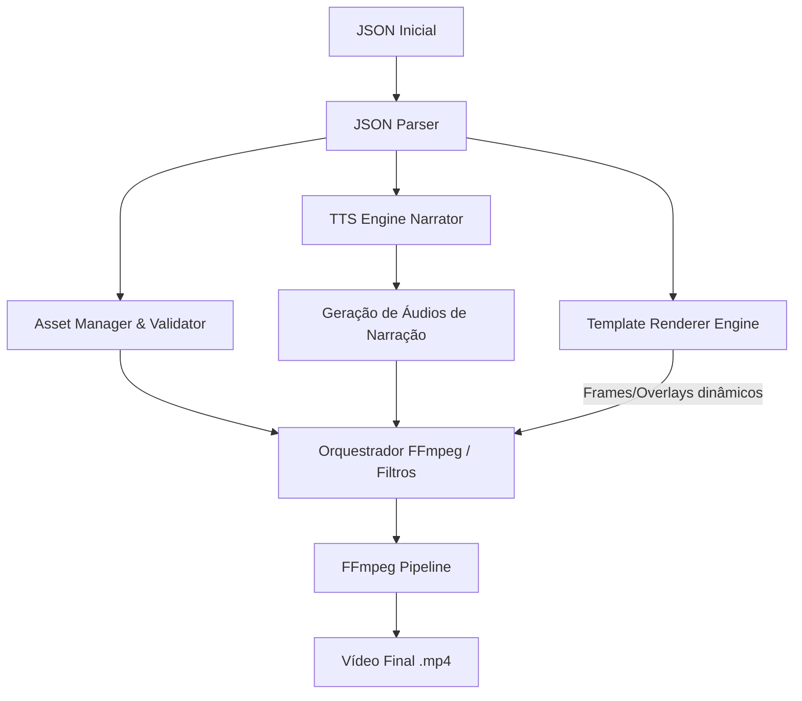

# Plano de Implementação: Gerador de Vídeo Automatizado em Go (Ecossistema Crom)

Este documento descreve o planejamento, arquitetura e passos de implementação para um sistema escrito em **Go** que consome um arquivo de configuração JSON (conforme o modelo em [`json_inicial`](file:///home/j/Documentos/GitHub/crom-test1/json_inicial)) e gera um vídeo final completo (MP4) com trilha sonora, narração por inteligência artificial (TTS), transições e templates visuais personalizados.

---

## 1. Visão Geral da Arquitetura

O sistema será estruturado como uma pipeline sequencial baseada em etapas claras de processamento:



### Componentes Principais

1. **JSON Parser**: Mapeamento do JSON para structs nativas em Go.
2. **Asset Manager**: Validador de caminhos e recursos (imagens, vídeos, trilhas sonoras). Garante que todos os recursos locais ou remotos existam antes do início do processamento.
3. **TTS Engine (Text-to-Speech)**: Módulo responsável por converter os textos de cada cena em arquivos de áudio `.mp3` ou `.wav` temporários, utilizando uma API externa (como Google Cloud TTS, OpenAI Audio, ElevenLabs) ou um gerador local.
4. **Template & Overlay Renderer**: Renderizador responsável por gerar overlays dinâmicos (como textos estruturados, destaques, bullet points) usando bibliotecas gráficas do Go (como `gg` ou `draw`) ou automatizadores headless (como `chromedp` para renderizar HTML/CSS complexos para imagens transparentes).
5. **FFmpeg Engine**: O núcleo de processamento de vídeo que monta os comandos complexos de filtro (`filtergraph`) do FFmpeg para combinar ativos, áudios de narração, trilha de fundo, efeitos de zoom, transições e cortes de velocidade.

---

## 2. Modelagem de Dados em Go (`structs`)

O mapeamento direto do arquivo [`json_inicial`](file:///home/j/Documentos/GitHub/crom-test1/json_inicial) em Go será feito com as seguintes estruturas:

```go
package main

type AudioConfig struct {
	SampleRate       int    `json:"sample_rate"`
	Bitrate          string `json:"bitrate"`
	Canais           int    `json:"canais"`
	Codec            string `json:"codec"`
	NormalizarVolume bool   `json:"normalizar_volume"`
}

type GlobalConfig struct {
	Resolucao    string      `json:"resolucao"`
	FPS          int         `json:"fps"`
	FormatoSaida string      `json:"formato_saida"`
	Audio        AudioConfig `json:"audio"`
}

type TrilhaSonora struct {
	Arquivo string  `json:"arquivo"`
	Volume  float64 `json:"volume"`
	Loop    bool    `json:"loop"`
}

type Template struct {
	ID         string                 `json:"id"`
	Parametros map[string]interface{} `json:"parametros"`
}

type Ativo struct {
	Tipo    string `json:"tipo"`
	Caminho string `json:"caminho"`
}

type Narracao struct {
	Texto string `json:"texto"`
	Voz   string `json:"voz"`
}

type Cena struct {
	ID       int      `json:"id"`
	Template Template `json:"template"`
	Ativo    Ativo    `json:"ativo"`
	Narracao Narracao `json:"narracao"`
}

type Projeto struct {
	Titulo               string       `json:"titulo"`
	ConfiguracoesGlobais GlobalConfig `json:"configuracoes_globais"`
	TrilhaSonora         TrilhaSonora `json:"trilha_sonora"`
	Cenas                []Cena       `json:"cenas"`
}

type ConfigInput struct {
	Projeto Projeto `json:"projeto"`
}
```

---

## 3. Funcionamento dos Templates de Cena

Cada cena possui um template específico que determina o comportamento visual e de tempo. A duração da cena é dada pela **duração do áudio da narração** gerado pelo TTS (ou uma duração mínima padrão se não houver narração).

### Detalhamento dos Filtros FFmpeg por Template:

1. **`intro_branding`**
   - **Comportamento**: Zoom lento na imagem e overlay escuro com opacidade customizada para destacar o título.
   - **FFmpeg**: Filtro `zoompan` com velocidade de zoom progressiva (ex: `1.1`) e filtro `color` misturado com `overlay` para a opacidade escura.

2. **`cinematic_video`**
   - **Comportamento**: Exibição de um vídeo de fundo com correção de cor (ex: tom mais frio/cyan) e desfoque se parametrizado.
   - **FFmpeg**: Filtros `eq` (contraste/brilho), `hue` ou LUTs 3D para o color grading, e `boxblur` se o parâmetro `blur_amount` for maior que zero.

3. **`technical_specs`**
   - **Comportamento**: Exibição de um diagrama de fluxo com tópicos/bullets textuais animados ou estáticos sobrepostos nas laterais.
   - **FFmpeg/Go**: Renderização de uma imagem transparente PNG contendo o texto estilizado (usando a biblioteca gráfica do Go) e sobreposição (`overlay`) acima da imagem de fundo.

4. **`split_screen_demo`**
   - **Comportamento**: Vídeo cortado ou posicionado lado a lado com outro conteúdo ou borda divisória destacando a CLI.
   - **FFmpeg**: Filtro `hstack` ou `overlay` calculando posições com base em `divider_pos`.

5. **`highlight_focus`**
   - **Comportamento**: Destacar uma área específica da imagem (ex: canto superior direito) escurecendo o resto do fundo.
   - **FFmpeg**: Máscaras de luminância ou sobreposição de PNG gerado dinamicamente com gradiente radial/retangular transparente na zona de foco.

6. **`action_video_fast`**
   - **Comportamento**: Acelerador de vídeo de ação com desfoque de movimento.
   - **FFmpeg**: Filtros `setpts=0.67*PTS` para velocidade 1.5x e `tblend` / `minterpolate` para motion blur.

7. **`outro_credits`**
   - **Comportamento**: Transição suave de fade out no final e sobreposição de um QR code de marca.
   - **FFmpeg**: Filtros `fade=t=out` e `overlay` para aplicar a imagem do QR code.

---

## 4. Pipeline de Processamento (Passo a Passo)

1. **Fase de Inicialização e Parsing**:
   - O aplicativo Go lê o JSON inicial e valida os campos estruturais essenciais.
   - Cria-se um diretório temporário para guardar os arquivos intermediários (ex: `/tmp/crom-render-*`).

2. **Fase de Geração de Narrações (TTS)**:
   - Para cada cena, o texto de `narracao.texto` é enviado ao motor de TTS selecionado.
   - O arquivo de áudio resultante (ex: `cena_1_audio.mp3`) é salvo no diretório temporário.
   - O sistema detecta automaticamente a **duração exata** de cada arquivo de áudio gerado (usando `ffprobe`). Essa duração define a duração daquela cena.

3. **Fase de Renderização das Cenas Individuais**:
   - Para cada cena:
     - Se o ativo for uma **imagem**: Ela é convertida em um fluxo de vídeo temporário com a duração da narração correspondente e com o FPS global configurado.
     - Se o ativo for um **vídeo**: Ele é cortado/ajustado para bater com a duração da narração, aplicando o filtro de velocidade se necessário.
     - Aplica-se o filtro correspondente ao `template.id` daquela cena.
     - Mescla-se o áudio de narração da cena no vídeo temporário.
     - Exemplo de comando gerado por cena:
       ```bash
       ffmpeg -loop 1 -i assets/img/capa_projeto.jpg -i /tmp/cena_1_audio.mp3 \
         -filter_complex "[0:v]zoompan=z='min(zoom+0.0015,1.1)':d=150:s=1920x1080[v]" \
         -map "[v]" -map 1:a -c:v libx264 -pix_fmt yuv420p -c:a aac -t 5.0 /tmp/cena_1_output.mp4
       ```

4. **Fase de Concatenação de Cenas**:
   - Gera-se um arquivo de texto contendo a lista de todos os vídeos de cena temporários (`/tmp/cena_1_output.mp4`, `/tmp/cena_2_output.mp4`, etc.).
   - Utiliza-se o demuxer `concat` do FFmpeg para juntar as cenas rapidamente sem re-encodificar (se todas utilizarem o mesmo codec, resolução e FPS).
     ```bash
     ffmpeg -f concat -safe 0 -i /tmp/lista_cenas.txt -c copy /tmp/video_sem_trilha.mp4
     ```

5. **Fase de Mixagem de Áudio Final**:
   - Pega-se a trilha sonora configurada (`trilha_sonora.arquivo`).
   - Aplica-se loop na música de fundo se necessário, ajustando o volume relativo (ex: `0.12`).
   - Mescla-se a música de fundo com os áudios já presentes no vídeo concatenado (as narrações).
   - Aplica-se normalização de áudio global se `normalizar_volume` for `true`.
   - Gera-se o arquivo final no formato de saída configurado (ex: `output.mp4`).

---

## 5. Estrutura do Projeto Go Sugerida

```text
/crom-video-generator
├── plan.md               # Este plano
├── json_inicial          # Configuração JSON de entrada
├── go.mod                # Módulo Go
├── main.go               # Ponto de entrada do CLI
├── assets/               # Imagens, vídeos e áudios base do projeto
│   ├── audio/
│   ├── img/
│   └── video/
├── internal/
│   ├── config/           # Parser e validação do JSON
│   ├── tts/              # Interface e adaptadores para TTS (Google, ElevenLabs, Local)
│   ├── render/           # Orquestrador de comandos do FFmpeg
│   └── templates/        # Implementação visual de cada ID de template
└── temp/                 # Arquivos temporários criados no render (ignorados no git)
```

---

## 6. Próximos Passos Recomendados

1. **Configuração de Dependências do Sistema**: Instalação e verificação de `ffmpeg` e `ffprobe` no ambiente.
2. **Criação do Protótipo em Go**:
   - Configurar o `go.mod`.
   - Criar os pacotes de parsing do JSON.
3. **Mock do TTS**: Implementar um adaptador de TTS temporário que gere arquivos de áudio silenciados (ou usando TTS local simples) para testar a pipeline de vídeo antes de configurar chaves de APIs pagas.
4. **Construção do Pipeline do FFmpeg**: Focar primeiro na renderização de imagens estáticas e depois avançar para a aplicação dos filtros complexos dos templates visuais.
